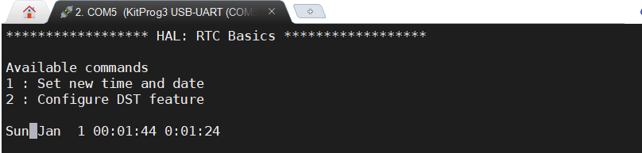
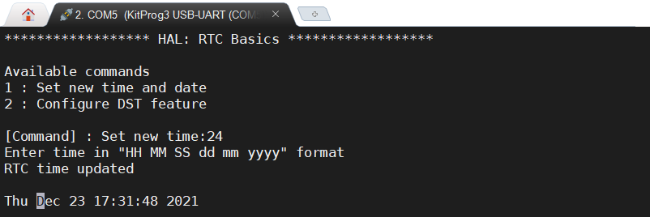
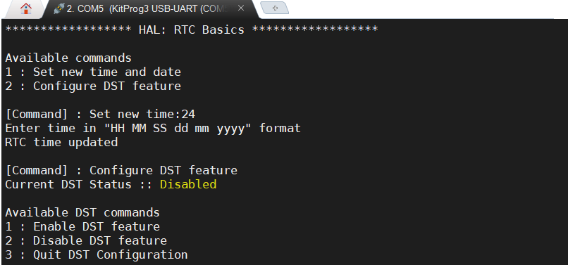
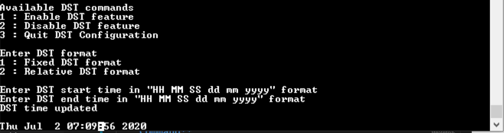
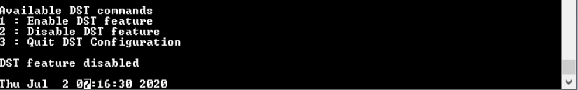
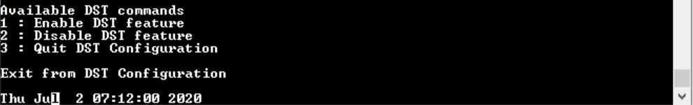

# HAL: Real-time clock basics

This example demonstrates the usage of the real-time clock (RTC) in Infineon MCU. It shows how to get and set the time in the RTC using the RTC HAL API. The example also supports the daylight saving time (DST) feature. A UART interface is used to input the time and configure the RTC.

[View this README on GitHub.](https://github.com/Infineon/mtb-example-hal-rtc-basics)

[Provide feedback on this code example.](https://cypress.co1.qualtrics.com/jfe/form/SV_1NTns53sK2yiljn?Q_EED=eyJVbmlxdWUgRG9jIElkIjoiQ0UyMjU3NDAiLCJTcGVjIE51bWJlciI6IjAwMi0yNTc0MCIsIkRvYyBUaXRsZSI6IkhBTDogUmVhbC10aW1lIGNsb2NrIGJhc2ljcyIsInJpZCI6InNkYWsiLCJEb2MgdmVyc2lvbiI6IjMuNC4wIiwiRG9jIExhbmd1YWdlIjoiRW5nbGlzaCIsIkRvYyBEaXZpc2lvbiI6Ik1DRCIsIkRvYyBCVSI6IklDVyIsIkRvYyBGYW1pbHkiOiJQU09DIn0=)


## Requirements

- [ModusToolbox&trade;](https://www.infineon.com/modustoolbox) v3.1 or later (tested with v3.1)
- Board Support Package (BSP) minimum required version for:
   - PSoC&trade; 6 MCU: 4.2.0
   - KIT_XMC72_EVK: v2.0.0
   - CYW920829M2EVK-02: v1.0.1
   - CYW989829M2EVB-01: v1.0.1
- Programming language: C
- Associated parts: All [PSoC&trade; 6 MCU](https://www.infineon.com/cms/en/product/microcontroller/32-bit-psoc-arm-cortex-microcontroller/psoc-6-32-bit-arm-cortex-m4-mcu), [XMC7000 MCU](https://www.infineon.com/cms/en/product/microcontroller/32-bit-industrial-microcontroller-based-on-arm-cortex-m/), [TRAVEO™ T2G body high MCU](https://www.infineon.com/cms/en/product/microcontroller/32-bit-traveo-t2g-arm-cortex-microcontroller/32-bit-traveo-t2g-arm-cortex-for-body/traveo-t2g-cyt4bf-series/) parts and [AIROC&trade; CYW20829 Bluetooth&reg; LE SoC](https://www.infineon.com/cms/en/product/promopages/airoc20829)


## Supported toolchains (make variable 'TOOLCHAIN')

- GNU Arm&reg; Embedded Compiler v11.3.1 (`GCC_ARM`) – Default value of `TOOLCHAIN`
- Arm&reg; Compiler v6.16 (`ARM`)
- IAR C/C++ Compiler v9.30.1 (`IAR`)


## Supported kits (make variable 'TARGET')

- [PSoC&trade; 62S2 Wi-Fi Bluetooth&reg; Prototyping Kit](https://www.infineon.com/CY8CPROTO-062S2-43439) (`CY8CPROTO-062S2-43439`) – Default value of `TARGET`
- [AIROC&trade; CYW20829 Bluetooth&reg; LE Evaluation Kit](https://www.infineon.com/CYW920829M2EVK-02) (`CYW920829M2EVK-02`)
- [AIROC&trade; CYW89829 Bluetooth&reg; LE evaluation Kit](https://www.infineon.com/CYW989829M2EVB-01) (`CYW989829M2EVB-01`)
- [PSoC&trade; 6 Wi-Fi Bluetooth&reg; Prototyping Kit](https://www.infineon.com/CY8CPROTO-062-4343W) (`CY8CPROTO-062-4343W`)
- [PSoC&trade; 6 Wi-Fi Bluetooth&reg; Pioneer Kit](https://www.infineon.com/CY8CKIT-062-WIFI-BT) (`CY8CKIT-062-WIFI-BT`)
- [PSoC&trade; 6 Bluetooth&reg; LE Pioneer Kit](https://www.infineon.com/CY8CKIT-062-BLE) (`CY8CKIT-062-BLE`)
- [PSoC&trade; 6 Bluetooth&reg; LE Prototyping Kit](https://www.infineon.com/CY8CPROTO-063-BLE) (`CY8CPROTO-063-BLE`)
- [EZ-BLE Arduino Evaluation Board](https://www.infineon.com/cms/en/product/evaluation-boards/cyble-416045-eval/) (`CYBLE-416045-EVAL`)
- [PSoC&trade; 62S2 Wi-Fi Bluetooth&reg; Pioneer Kit](https://www.infineon.com/CY8CKIT-062S2-43012) (`CY8CKIT-062S2-43012`)
- [PSoC&trade; 62S1 Wi-Fi Bluetooth&reg; Pioneer Kit](https://www.infineon.com/CYW9P62S1-43438EVB-01) (`CYW9P62S1-43438EVB-01`)
- [PSoC&trade; 62S1 Wi-Fi Bluetooth&reg; Pioneer Kit](https://www.infineon.com/CYW9P62S1-43012EVB-01) (`CYW9P62S1-43012EVB-01`)
- [PSoC&trade; 64 "Secure Boot" Wi-Fi Bluetooth&reg; Pioneer Kit](https://www.infineon.com/CY8CKIT-064B0S2-4343W) (`CY8CKIT-064B0S2-4343W`)
- [PSoC&trade; 62S4 Pioneer Kit](https://www.infineon.com/CY8CKIT-062S4) (`CY8CKIT-062S4`)
- [PSoC&trade; 62S2 Evaluation Kit](https://www.infineon.com/CY8CEVAL-062S2) (`CY8CEVAL-062S2`, `CY8CEVAL-062S2-LAI-4373M2`, `CY8CEVAL-062S2-MUR-43439M2`)
- [PSoC&trade; 64 "Secure Boot" Prototyping Kit](https://www.infineon.com/CY8CPROTO-064B0S3) (`CY8CPROTO-064B0S3`)
- [PSoC&trade; 64 "Secure Boot" Prototyping Kit](https://www.infineon.com/CY8CPROTO-064S1-SB) (`CY8CPROTO-064S1-SB`)
- [XMC7200 Evaluation Kit](https://www.infineon.com/KIT_XMC72_EVK) (`KIT_XMC72_EVK`)
- [XMC7100 Evaluation Kit](https://www.infineon.com/KIT_XMC71_EVK_LITE_V1) (`KIT_XMC71_EVK_LITE_V1`)
- [TRAVEO™ T2G body high Evaluation Kit](https://www.infineon.com/KIT_T2G-B-H_EVK) (`KIT_T2G-B-H_EVK`)
- [TRAVEO™ T2G body high Evaluation Kit](https://www.infineon.com/KIT_T2G-B-H_LITE) (`KIT_T2G-B-H_LITE`)
- [PSoC&trade; 62S3 Wi-Fi Bluetooth&reg; Prototyping Kit](https://www.infineon.com/CY8CPROTO-062S3-4343W) (`CY8CPROTO-062S3-4343W`)


## Hardware Setup

This example uses the board's default configuration. See the kit user guide to ensure that the board is configured correctly.

> **Note:** The PSoC&trade; 6 Bluetooth&reg; LE Pioneer Kit (CY8CKIT-062-BLE) and the PSoC&trade; 6 Wi-Fi Bluetooth&reg; Pioneer Kit (CY8CKIT-062-WIFI-BT) ship with KitProg2 installed. ModusToolbox&trade; requires KitProg3. Before using this code example, make sure that the board is upgraded to KitProg3. The tool and instructions are available in the [Firmware Loader](https://github.com/Infineon/Firmware-loader) GitHub repository. If you do not upgrade, you will see an error like "unable to find CMSIS-DAP device" or "KitProg firmware is out of date".

> **Note:** The AIROC&trade; CYW20829 Bluetooth&reg; Kit (CYW920829M2EVK-02) ships with KitProg3 version 2.21 installed. The ModusToolbox&trade; software requires KitProg3 with latest version 2.40. Before using this code example, make sure that the board is upgraded to KitProg3. The tool and instructions are available in the [Firmware Loader](https://github.com/Infineon/Firmware-loader) GitHub repository. If you do not upgrade, you will see an error such as "unable to find CMSIS-DAP device" or "KitProg firmware is out of date".


## Software setup

See the [ModusToolbox&trade; tools package installation guide](https://www.infineon.com/ModusToolboxInstallguide) for information about installing and configuring the tools package.

Install a terminal emulator if you don't have one. Instructions in this document use [Tera Term](https://teratermproject.github.io/index-en.html).


## Using the code example


### Create the project

The ModusToolbox&trade; tools package provides the Project Creator as both a GUI tool and a command line tool.

<details><summary><b>Use Project Creator GUI</b></summary>

1. Open the Project Creator GUI tool.

   There are several ways to do this, including launching it from the dashboard or from inside the Eclipse IDE. For more details, see the [Project Creator user guide](https://www.infineon.com/ModusToolboxProjectCreator) (locally available at *{ModusToolbox&trade; install directory}/tools_{version}/project-creator/docs/project-creator.pdf*).

2. On the **Choose Board Support Package (BSP)** page, select a kit supported by this code example. See [Supported kits](#supported-kits-make-variable-target).

   > **Note:** To use this code example for a kit not listed here, you may need to update the source files. If the kit does not have the required resources, the application may not work.

3. On the **Select Application** page:

   a. Select the **Applications(s) Root Path** and the **Target IDE**.

   > **Note:** Depending on how you open the Project Creator tool, these fields may be pre-selected for you.

   b.	Select this code example from the list by enabling its check box.

   > **Note:** You can narrow the list of displayed examples by typing in the filter box.

   c. (Optional) Change the suggested **New Application Name** and **New BSP Name**.

   d. Click **Create** to complete the application creation process.

</details>

<details><summary><b>Use Project Creator CLI</b></summary>

The 'project-creator-cli' tool can be used to create applications from a CLI terminal or from within batch files or shell scripts. This tool is available in the *{ModusToolbox&trade; install directory}/tools_{version}/project-creator/* directory.

Use a CLI terminal to invoke the 'project-creator-cli' tool. On Windows, use the command-line 'modus-shell' program provided in the ModusToolbox&trade; installation instead of a standard Windows command-line application. This shell provides access to all ModusToolbox&trade; tools. You can access it by typing "modus-shell" in the search box in the Windows menu. In Linux and macOS, you can use any terminal application.

The following example clones the "[mtb-example-hal-rtc-basics](https://github.com/Infineon/mtb-example-hal-rtc-basics)" application with the desired name "MyRTCBasics" configured for the *CY8CPROTO-062S2-43439* BSP into the specified working directory, *C:/mtb_projects*:

   ```
   project-creator-cli --board-id CY8CPROTO-062S2-43439 --app-id mtb-example-hal-rtc-basics --user-app-name MyRTCBasics --target-dir "C:/mtb_projects"
   ```

The 'project-creator-cli' tool has the following arguments:

 Argument | Description | Required/optional
 ---------|-------------|-----------
 `--board-id` | Defined in the <id> field of the [BSP](https://github.com/Infineon?q=bsp-manifest&type=&language=&sort=) manifest | Required
 `--app-id`   | Defined in the <id> field of the [CE](https://github.com/Infineon?q=ce-manifest&type=&language=&sort=) manifest | Required
 `--target-dir`| Specify the directory in which the application is to be created if you prefer not to use the default current working directory | Optional
 `--user-app-name`| Specify the name of the application if you prefer to have a name other than the example's default name | Optional

> **Note:** The project-creator-cli tool uses the `git clone` and `make getlibs` commands to fetch the repository and import the required libraries. For details, see the "Project creator tools" section of the [ModusToolbox&trade; tools package user guide](https://www.infineon.com/ModusToolboxUserGuide) (locally available at {ModusToolbox&trade; install directory}/docs_{version}/mtb_user_guide.pdf).

</details>


### Open the project

After the project has been created, you can open it in your preferred development environment.


<details><summary><b>Eclipse IDE</b></summary>

If you opened the Project Creator tool from the included Eclipse IDE, the project will open in Eclipse automatically.

For more details, see the [Eclipse IDE for ModusToolbox&trade; user guide](https://www.infineon.com/MTBEclipseIDEUserGuide) (locally available at *{ModusToolbox&trade; install directory}/docs_{version}/mt_ide_user_guide.pdf*).

</details>


<details><summary><b>Visual Studio (VS) Code</b></summary>

Launch VS Code manually, and then open the generated *{project-name}.code-workspace* file located in the project directory.

For more details, see the [Visual Studio Code for ModusToolbox&trade; user guide](https://www.infineon.com/MTBVSCodeUserGuide) (locally available at *{ModusToolbox&trade; install directory}/docs_{version}/mt_vscode_user_guide.pdf*).

</details>


<details><summary><b>Keil µVision</b></summary>

Double-click the generated *{project-name}.cprj* file to launch the Keil µVision IDE.

For more details, see the [Keil µVision for ModusToolbox&trade; user guide](https://www.infineon.com/MTBuVisionUserGuide) (locally available at *{ModusToolbox&trade; install directory}/docs_{version}/mt_uvision_user_guide.pdf*).

</details>


<details><summary><b>IAR Embedded Workbench</b></summary>

Open IAR Embedded Workbench manually, and create a new project. Then select the generated *{project-name}.ipcf* file located in the project directory.

For more details, see the [IAR Embedded Workbench for ModusToolbox&trade; user guide](https://www.infineon.com/MTBIARUserGuide) (locally available at *{ModusToolbox&trade; install directory}/docs_{version}/mt_iar_user_guide.pdf*).

</details>


<details><summary><b>Command line</b></summary>

If you prefer to use the CLI, open the appropriate terminal, and navigate to the project directory. On Windows, use the command-line 'modus-shell' program; on Linux and macOS, you can use any terminal application. From there, you can run various `make` commands.

For more details, see the [ModusToolbox&trade; tools package user guide](https://www.infineon.com/ModusToolboxUserGuide) (locally available at *{ModusToolbox&trade; install directory}/docs_{version}/mtb_user_guide.pdf*).

</details>


## Operation

If using a PSoC&trade; 64 "Secure" MCU kit (like CY8CKIT-064B0S2-4343W), the PSoC&trade; 64 device must be provisioned with keys and policies before being programmed. Follow the instructions in the ["Secure Boot" SDK user guide](https://www.infineon.com/dgdlac/Infineon-PSoC_64_Secure_MCU_Secure_Boot_SDK_User_Guide-Software-v07_00-EN.pdf?fileId=8ac78c8c7d0d8da4017d0f8c361a7666) to provision the device. If the kit is already provisioned, copy-paste the keys and policy folder to the application folder.

1. Connect the board to your PC using the provided USB cable through the KitProg3 USB connector.

2. Open a terminal program and select the KitProg3 COM port. Set the serial port parameters to 8N1 and 115200 baud.

3. Program the board using one of the following:

   <details><summary><b>Using Eclipse IDE</b></summary>

      1. Select the application project in the Project Explorer.

      2. In the **Quick Panel**, scroll down, and click **\<Application Name> Program (KitProg3_MiniProg4)**.
   </details>


   <details><summary><b>In other IDEs</b></summary>

   Follow the instructions in your preferred IDE.
   </details>


   <details><summary><b>Using CLI</b></summary>

     From the terminal, execute the `make program` command to build and program the application using the default toolchain to the default target. The default toolchain is specified in the application's Makefile but you can override this value manually:
      ```
      make program TOOLCHAIN=<toolchain>
      ```

      Example:
      ```
      make program TOOLCHAIN=GCC_ARM
      ```
   </details>

4. After programming, the application starts automatically. Confirm that "HAL: RTC Basics" is displayed on the UART terminal.

    **Figure 1. Terminal window on startup**

    

5. Type `1` in the main menu. You will be prompted for new date and time. Enter the new date and time, and press **Enter**.

   If an incorrect date or time is entered, a warning message is printed.

    **Figure 2. Set time command**

    


6. Type `2` in the main menu. You will be prompted to configure the DST feature in the sub menu.

   The current DST status will be displayed along with the available DST commands.

    **Figure 3. Configure DST feature command**

    


7. Type `1` in the sub-menu. When prompted, enter the DST format (*Fixed DST format* or *Relative DST format*), followed by the new DST start and end time.

    If an incorrect date or time is entered, a warning message is printed.

    **Figure 4. Enable DST feature command**

    

    **Note:** While using DST, it can either be in fixed DST format or in a relative DST format.

      An example of fixed DST format: begins on 21st March and ends on 21st September.

      An example of relative DST format: begins on the last Sunday of March and ends on the last Sunday of October.

8. Type `2` in the sub-menu to disable the DST feature:

    **Figure 5. 'Disable DST feature' command**

    

9. Type `3` in the sub-menu to quit DST configuration:

    **Figure 6. 'Quit DST configuration' command**

    


## Debugging

You can debug the example to step through the code.


<details><summary><b>In Eclipse IDE</b></summary>

Use the **\<Application Name> Debug (KitProg3_MiniProg4)** configuration in the **Quick Panel**. For details, see the "Program and debug" section in the [Eclipse IDE for ModusToolbox&trade; user guide](https://www.infineon.com/MTBEclipseIDEUserGuide).

> **Note:** **(Only while debugging)** On the CM4 CPU, some code in `main()` may execute before the debugger halts at the beginning of `main()`. This means that some code executes twice – once before the debugger stops execution, and again after the debugger resets the program counter to the beginning of `main()`. See [KBA231071](https://community.infineon.com/docs/DOC-21143) to learn about this and for the workaround.

</details>


<details><summary><b>In other IDEs</b></summary>

Follow the instructions in your preferred IDE.

</details>


## Design and implementation

This code example features the RTC resource and one UART resource. The RTC resource provides time and date information – second, minute, hour, day of the week, date, month, and year. The time and date information are updated every second with automatic leap-year compensation performed by the RTC hardware block.

The CPU waits for the line feed (LF) or the carriage return (CR) character from the serial terminal. When it is received, the code parses the commands that have been sent:

- If the input command is ‘1’, updates the RTC with the new date and time

- If the input command is ‘2’, enters the sub-menu where you can configure the DST feature using the following inputs:

    - If the input command is ‘1’ in the sub-menu, updates the RTC, when DST should start and end

    - If the input command is ‘2’ in the sub menu, disables the DST feature

    - If the input command is ‘3’ in the sub menu, quits the DST configuration

The application uses the RTC resource from the [Hardware abstraction layer](https://github.com/Infineon/mtb-hal-cat1) (HAL) to read or update the RTC peripheral.

An RTC HAL resource is configured as a pointer to an RTC object whose contents are initialized by the `cyhal_rtc_init` function. This function also powers up the RTC in preparation for access.

The current time and date can be read from the RTC peripheral using the `cyhal_rtc_read`  function. Similarly, the `cyhal_rtc_write` function is used to write the specified time and date to the RTC peripheral.

In addition to these methods, the DST feature can be configured using the following functions:

- `set_dst_feature`: To enable the DST feature. Internally uses RTC HAL functions.

- `cyhal_rtc_set_dst`: To set DST start and end time

- `cyhal_rtc_is_dst `: To check if DST is currently active


### Resources and settings

**Table 1. Application resources**

 Resource  |  Alias/object     |    Purpose     
 :------- | :------------    | :------------ 
 UART (HAL)|cy_retarget_io_uart_obj| UART HAL object used by retarget-io for debug UART port  
 RTC  (HAL)|rtc_obj| RTC HAL object for RTC interface  

<br>


## Related resources

 Resources  | Links
 -----------|----------------------------------
 Application notes  | [AN228571](https://www.infineon.com/AN228571) – Getting started with PSoC&trade; 6 MCU on ModusToolbox&trade; software <br> [AN234334](https://www.infineon.com/dgdl/Infineon-AN234334_Getting_started_with_XMC7000_MCU_on_ModusToolbox_software-ApplicationNotes-v01_00-EN.pdf?fileId=8ac78c8c8412f8d301842d32c5765bfd) – Getting started with XMC7000 MCU on ModusToolbox&trade; | Describes XMC7000 MCU devices and how to build your first application with ModusToolbox&trade; software
 Code examples  | [Using ModusToolbox&trade;](https://github.com/Infineon/Code-Examples-for-ModusToolbox-Software) on GitHub <br> [Using PSoC&trade; Creator](https://www.infineon.com/cms/en/design-support/software/code-examples/psoc-3-4-5-code-examples-for-psoc-creator)
 Device documentation | [PSoC&trade; 6 MCU datasheets](https://documentation.infineon.com/html/psoc6/bnm1651211483724.html) <br> [PSoC&trade; 6 technical reference manuals](https://documentation.infineon.com/html/psoc6/zrs1651212645947.html)<br> [PSoC&trade; 4 datasheets](https://www.infineon.com/cms/en/search.html?intc=searchkwr-return#!view=downloads&term=psoc%204&doc_group=Data%20Sheet) <br>[PSoC&trade; 4 technical reference manuals](https://www.infineon.com/cms/en/search.html#!term=psoc%204%20technical%20reference%20manual&view=all)
 Development kits | Select your kits from the [Evaluation board finder](https://www.infineon.com/cms/en/design-support/finder-selection-tools/product-finder/evaluation-board)
 Libraries on GitHub  | [mtb-pdl-cat1](https://github.com/Infineon/mtb-pdl-cat1) – PSoC&trade; 6 peripheral driver library (PDL)  <br> [mtb-hal-cat1](https://github.com/Infineon/mtb-hal-cat1) – Hardware abstraction layer (HAL) library <br> [retarget-io](https://github.com/Infineon/retarget-io) – Utility library to retarget STDIO messages to a UART port <br>  [mtb-pdl-cat2](https://github.com/Infineon/mtb-pdl-cat2) – PSoC&trade; 4 peripheral driver library (PDL) <br />  [mtb-hal-cat2](https://github.com/Infineon/mtb-hal-cat2) – Hardware abstraction layer (HAL) library
 Middleware on GitHub  | [capsense](https://github.com/Infineon/capsense) – CAPSENSE&trade; library and documents <br> [psoc6-middleware](https://github.com/Infineon/modustoolbox-software#psoc-6-middleware-libraries) – Links to all PSoC&trade; 6 MCU middleware
 Tools  | [Eclipse IDE for ModusToolbox&trade;](https://www.infineon.com/modustoolbox) – ModusToolbox&trade; software is a collection of easy-to-use software and tools enabling rapid development with Infineon MCUs, covering applications from embedded sense and control to wireless and cloud-connected systems using AIROC&trade; Wi-Fi and Bluetooth&reg; connectivity devices. <br> [PSoC&trade; Creator](https://www.infineon.com/cms/en/design-support/tools/sdk/psoc-software/psoc-creator/) – IDE for PSoC&trade; and FM0+ MCU development

<br />


## Other resources

Infineon provides a wealth of data at [www.infineon.com](https://www.infineon.com) to help you select the right device, and quickly and effectively integrate it into your design.

For XMC&trade; MCU devices, see [32-bit XMC&trade; Industrial microcontroller based on Arm® Cortex®-M](https://www.infineon.com/cms/en/product/microcontroller/32-bit-industrial-microcontroller-based-on-arm-cortex-m/).


## Document history

Document title: *CE225740* – *HAL: Real-time clock basics*

 Version | Description of change 
 ------- | --------------------- 
 1.0.0   | New code example      
 1.1.0   | Updated to support ModusToolbox&trade; software v2.1.<br>Minor formatting changes to the code.  
 2.0.0   | Major update to support ModusToolbox&trade; software v2.2, added support for new kits.<br /> This version is not backward compatible with ModusToolbox&trade; software v2.1.  
 2.1.0   | Added support for CYSBSYSKIT-DEV-01 Rapid IoT Connect developer kit 
 2.1.1   | Updated to support ModusToolbox&trade; software v2.3.<br /> Added support for CY8CKIT-062S4. 
 3.0.0   | Major update to support ModusToolbox&trade; software v3.0. <br> Added support for KIT_XMC72_EVK. 
 3.1.0   | Added support for CY8CEVAL-062S2, CY8CEVAL-062S2-LAI-4373M2, CY8CEVAL-062S2-MUR-43439M2, CY8CPROTO-064B0S3, and CY8CPROTO-064S1-SB. 
 3.2.0   | Added support for CYW920829M2EVK-02, KIT_T2G-B-H_EVK and KIT_T2G-B-H_LITE <br> Replaced retarget_io_init() with retarget_io_init_fc() function. 
 3.3.0   | Added support for KIT_XMC71_EVK_LITE_V1, CYBLE-416045-EVAL and CY8CPROTO-062S2-43439. <br> Updated to support ModusToolbox&trade; v3.1. 
 3.4.0   | Added support for CYW989829M2EVB-01 
 
<br>


All referenced product or service names and trademarks are the property of their respective owners.

The Bluetooth&reg; word mark and logos are registered trademarks owned by Bluetooth SIG, Inc., and any use of such marks by Infineon is under license.


---------------------------------------------------------

© Cypress Semiconductor Corporation, 2020-2023. This document is the property of Cypress Semiconductor Corporation, an Infineon Technologies company, and its affiliates ("Cypress").  This document, including any software or firmware included or referenced in this document ("Software"), is owned by Cypress under the intellectual property laws and treaties of the United States and other countries worldwide.  Cypress reserves all rights under such laws and treaties and does not, except as specifically stated in this paragraph, grant any license under its patents, copyrights, trademarks, or other intellectual property rights.  If the Software is not accompanied by a license agreement and you do not otherwise have a written agreement with Cypress governing the use of the Software, then Cypress hereby grants you a personal, non-exclusive, nontransferable license (without the right to sublicense) (1) under its copyright rights in the Software (a) for Software provided in source code form, to modify and reproduce the Software solely for use with Cypress hardware products, only internally within your organization, and (b) to distribute the Software in binary code form externally to end users (either directly or indirectly through resellers and distributors), solely for use on Cypress hardware product units, and (2) under those claims of Cypress's patents that are infringed by the Software (as provided by Cypress, unmodified) to make, use, distribute, and import the Software solely for use with Cypress hardware products.  Any other use, reproduction, modification, translation, or compilation of the Software is prohibited.
<br>
TO THE EXTENT PERMITTED BY APPLICABLE LAW, CYPRESS MAKES NO WARRANTY OF ANY KIND, EXPRESS OR IMPLIED, WITH REGARD TO THIS DOCUMENT OR ANY SOFTWARE OR ACCOMPANYING HARDWARE, INCLUDING, BUT NOT LIMITED TO, THE IMPLIED WARRANTIES OF MERCHANTABILITY AND FITNESS FOR A PARTICULAR PURPOSE.  No computing device can be absolutely secure.  Therefore, despite security measures implemented in Cypress hardware or software products, Cypress shall have no liability arising out of any security breach, such as unauthorized access to or use of a Cypress product. CYPRESS DOES NOT REPRESENT, WARRANT, OR GUARANTEE THAT CYPRESS PRODUCTS, OR SYSTEMS CREATED USING CYPRESS PRODUCTS, WILL BE FREE FROM CORRUPTION, ATTACK, VIRUSES, INTERFERENCE, HACKING, DATA LOSS OR THEFT, OR OTHER SECURITY INTRUSION (collectively, "Security Breach").  Cypress disclaims any liability relating to any Security Breach, and you shall and hereby do release Cypress from any claim, damage, or other liability arising from any Security Breach.  In addition, the products described in these materials may contain design defects or errors known as errata which may cause the product to deviate from published specifications. To the extent permitted by applicable law, Cypress reserves the right to make changes to this document without further notice. Cypress does not assume any liability arising out of the application or use of any product or circuit described in this document. Any information provided in this document, including any sample design information or programming code, is provided only for reference purposes.  It is the responsibility of the user of this document to properly design, program, and test the functionality and safety of any application made of this information and any resulting product.  "High-Risk Device" means any device or system whose failure could cause personal injury, death, or property damage.  Examples of High-Risk Devices are weapons, nuclear installations, surgical implants, and other medical devices.  "Critical Component" means any component of a High-Risk Device whose failure to perform can be reasonably expected to cause, directly or indirectly, the failure of the High-Risk Device, or to affect its safety or effectiveness.  Cypress is not liable, in whole or in part, and you shall and hereby do release Cypress from any claim, damage, or other liability arising from any use of a Cypress product as a Critical Component in a High-Risk Device. You shall indemnify and hold Cypress, including its affiliates, and its directors, officers, employees, agents, distributors, and assigns harmless from and against all claims, costs, damages, and expenses, arising out of any claim, including claims for product liability, personal injury or death, or property damage arising from any use of a Cypress product as a Critical Component in a High-Risk Device. Cypress products are not intended or authorized for use as a Critical Component in any High-Risk Device except to the limited extent that (i) Cypress's published data sheet for the product explicitly states Cypress has qualified the product for use in a specific High-Risk Device, or (ii) Cypress has given you advance written authorization to use the product as a Critical Component in the specific High-Risk Device and you have signed a separate indemnification agreement.
<br>
Cypress, the Cypress logo, and combinations thereof, ModusToolbox, PSoC, CAPSENSE, EZ-USB, F-RAM, and TRAVEO are trademarks or registered trademarks of Cypress or a subsidiary of Cypress in the United States or in other countries. For a more complete list of Cypress trademarks, visit www.infineon.com. Other names and brands may be claimed as property of their respective owners.